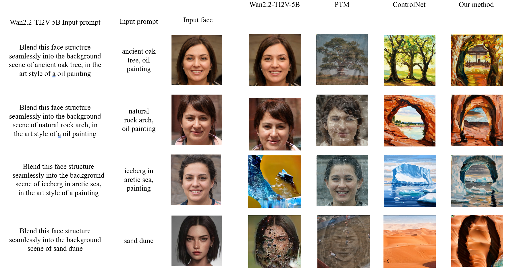
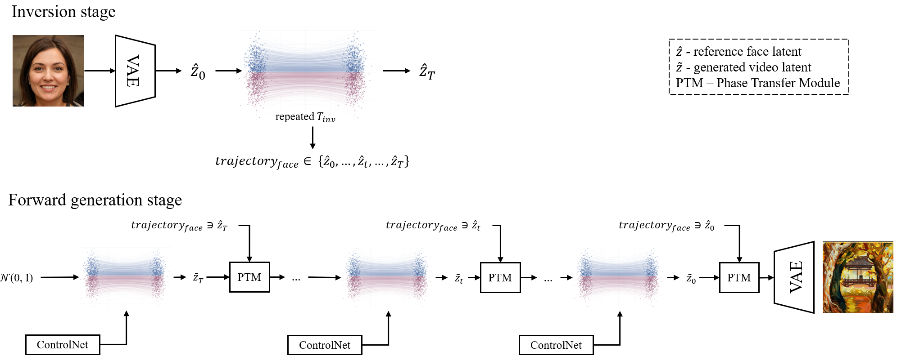

# Hidden in Plain Sight: Generation of Face-Based Optical Illusions in Text-to-Video Flow-Matching Models

Thesis code for **Hidden in Plain Sight: Generation of Face-Based Optical Illusions in Text-to-Video Flow-Matching Models**. [Paper link](<URL_TO_PUBLISHED_THESIS>)

*By Robert Grgac · University of Twente · MSc Computer Science · 2026*



This thesis explores the generation of *video-based* optical illusions: short clips that follow a text prompt while structurally embedding a reference face inside the scene. Building on PTDiffusion (an image-domain training-free method by [Gao et al. 2025](https://arxiv.org/abs/2503.06186)), the work extends the idea to a flow-matching text-to-video backbone (Wan 2.2 T2V-A14B) and combines it with a purpose-trained ControlNet, producing a hybrid training-free + training-based pipeline that maintains both prompt fidelity and a recognisable hidden face across frames.

---

## Contributions

1. **Novel video-domain optical illusion method.** A pipeline for generating face-based optical illusions in video using a flow-matching text-to-video model, combining a phase-transfer module with a purpose-trained ControlNet.
2. **Adaptive blending heuristic.** A PI-controlled heuristic blending schedule that replaces PTDiffusion's fixed schedule and outperforms it in the video domain.
3. **Spatial face-weighted ControlNet loss.** A modified flow-matching loss that up-weights face-region latent positions, producing more focused learning and stronger extraction of facial structure than uniform supervision.
4. **Extensive ablations and evaluation.** Quantitative metrics (FVD, LPIPS, RetinaFace detection, ViCLIP, aesthetic) and qualitative comparisons across four method conditions, plus ablations that justify the architectural and design decisions.

---

## Method overview



The pipeline uses two parallel trajectories on top of a frozen Wan 2.2 T2V-A14B flow-matching model. An **inversion trajectory** maps a reference face image to a per-step noise trajectory using the closed-form linear FlowMatch formula. A **sampling trajectory** generates the prompt-driven scene from random noise. At every denoising step the two are bridged by a phase-transfer module that swaps the spatial-FFT phase of the sampling latent toward the inversion latent, with the blending coefficient driven by an adaptive PI heuristic. A purpose-trained ControlNet, fed the face image and supervised with a spatial face-weighted loss, injects structural conditioning into the high-noise expert in parallel, keeping face structure stable across frames.

---

## Hardware requirements

Training: 1× GPU with ≥40 GB VRAM (an A40 was used for the thesis). Inference: 1× GPU with ≥24 GB VRAM (CPU offload is enabled in the pipeline).

---

## Setup

### 1. Download the pretrained models and dataset

The Wan 2.2 T2V-A14B base model is downloaded from Hugging Face into `models/wan2.2/`:

```bash
hf download Wan-AI/Wan2.2-T2V-A14B-Diffusers --local-dir models/wan2.2
```

The trained ControlNet checkpoint is published at [DataScientistRob/hidden-in-plain-sight](https://huggingface.co/DataScientistRob/hidden-in-plain-sight). Download it into `models/controlnet/`:

```bash
hf download DataScientistRob/hidden-in-plain-sight \
    controlnet.safetensors --local-dir models/controlnet
```

> The HED architecture config (`models/hed_config/config.json`) is vendored inside the repository no extra download.

The training dataset (100 reference faces + 10 000 target frames) is published at [DataScientistRob/hidden-in-plain-sight (dataset)](https://huggingface.co/datasets/DataScientistRob/hidden-in-plain-sight):

```bash
hf download DataScientistRob/hidden-in-plain-sight \
    --repo-type dataset --local-dir data
```

After this step you should have:
- `models/wan2.2/` containing `model_index.json` and the transformer / VAE / text-encoder subfolders.
- `models/controlnet/controlnet.safetensors` (skip if you plan to train it yourself).
- `data/raw_faces/face_*.png` (100 files) and `data/targets/face_*_*.jpg` (10 000 files).

### 2. Create the environment

The repository pins its full Python stack via `requirements.txt`; the conda yaml just provides a Python sandbox that delegates to pip:

```bash
conda env create -f environment.yml
conda activate wan22
```

If you prefer pip directly:

```bash
pip install --extra-index-url https://download.pytorch.org/whl/cu124 -r requirements.txt
```

### 3. Train the ControlNet

If you downloaded the pretrained ControlNet checkpoint above, **skip this step.** Otherwise, train it from scratch with:

```bash
python bootstrap.py
```

`bootstrap.py` verifies that the models and data are in place, runs the training precompute (silhouette + VAE latents + T5 prompt embeddings) if `cache/training/manifest.json` is missing, then trains the ControlNet for one epoch over the 10 000 face × prompt pairs. The final EMA-smoothed weights are saved to `models/controlnet/controlnet.safetensors`.

To enable wandb logging, pass both flags together:

```bash
python bootstrap.py --wandb_project my-project --wandb_run_name run-001
```

### 4. Run inference

Generate one video from a face image plus a scene prompt:

```bash
python inference.py path/to/face.png "snowy mountain, oil painting"
```

The result is written to `./output.mp4`. Every PTD and ControlNet hyperparameter can be overridden with optional flags (`--guidance_scale`, `--controlnet_weight`, `--seed`, …); see `python inference.py --help` for the full list.

### 5. Running on a Slurm cluster

Two example sbatch scripts at the repository root cover the common cases,  copy them and adapt the cluster-specific directives (`--partition`, `--account`, `--constraint`, time and memory limits) to your scheduler:

```bash
sbatch bootstrap-example.sbatch   # runs bootstrap.py (precompute + train)
sbatch inference-example.sbatch   # runs inference.py (one video)
```

The scripts already activate the `wan22` conda env and set the runtime environment variables (`DIFFUSERS_ATTN_BACKEND`, `HF_HUB_OFFLINE`, `PYTORCH_CUDA_ALLOC_CONF`). On Blackwell GPUs (SM 12.x) override `DIFFUSERS_ATTN_BACKEND=native` before submitting, since the bundled flash-attn kernels do not load there.

---

## Citation

```bibtex
@mastersthesis{grgac2026hidden,
  title  = {Hidden in Plain Sight: Generation of Face-Based Optical Illusions in Text-to-Video Flow-Matching Models},
  author = {Grgac, Robert},
  school = {University of Twente},
  year   = {2026},
  url    = {<URL_TO_PUBLISHED_THESIS>}
}
```

---

## License

Released under the [MIT License](LICENSE).
